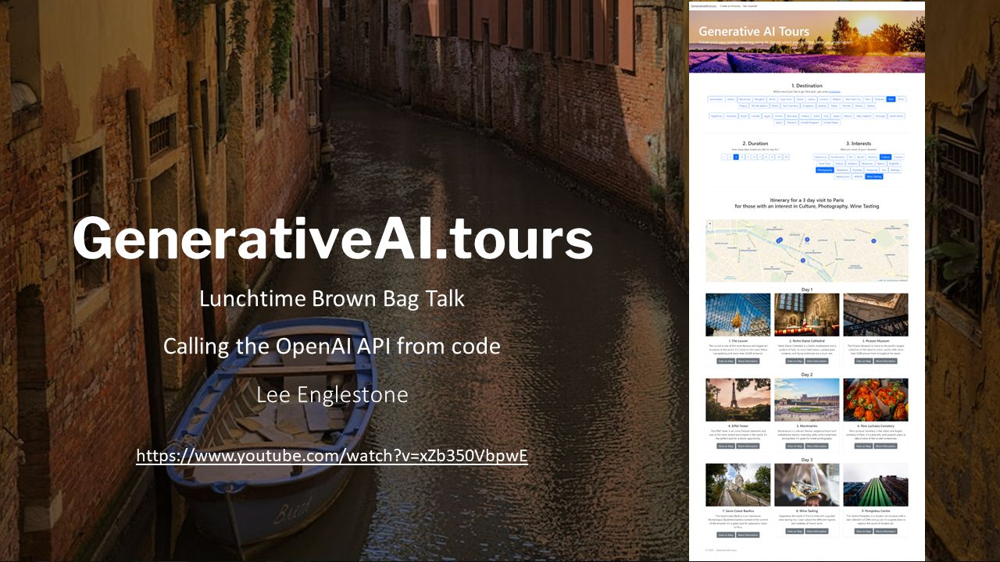
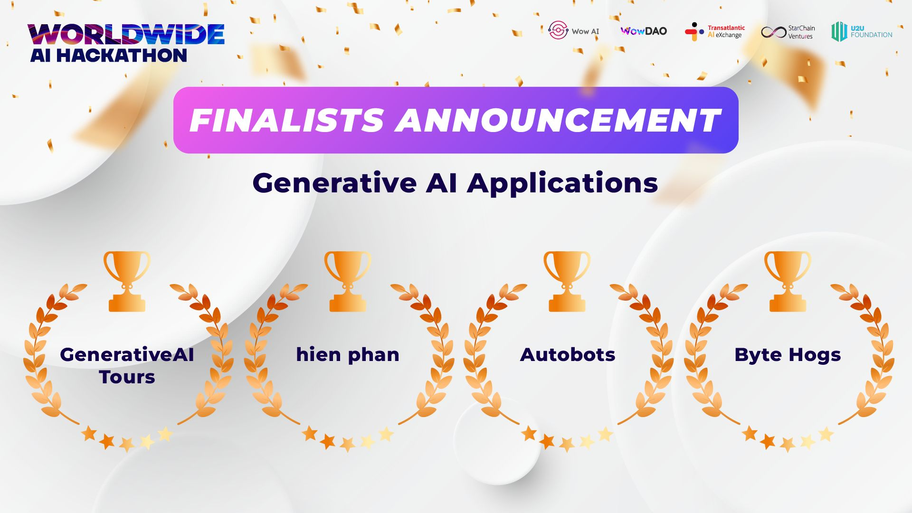

# GenerativeAITours
A better, more detailed readme.md coming soon!

This was a quick side project to see if I could use Generative AI by calling the Open AI API from JavaScript, C# and ASP.NET to generate a personalised travel itinerary.

## Open AI API
In order to call the Open AI API, you will need to provide your own Open AI API key in OpenAIConfig.cs

## Unsplash API
In order to call the Unsplash API, you will have to provide your own Unsplash API key in UnsplashConfig.cs

## Local cache
As this is just a POC, previously returned Open AI calls are stored in text files which serves as the response cache.
Previously requested images from the UnsplashAPI are also stored locally which serves as the image cache.

You can always implement your own cache (for example Azure blob storage) etc by implementing a different instance of IPromptCache and/or updating ImageCache.cs

## Walkthrough video
Here is a video, walking through the solution 

[https://www.youtube.com/watch?v=Z9N3Ii8lNRA](https://www.youtube.com/watch?v=Z9N3Ii8lNRA)

## Worldwide AI Hackathon Finalist
GenerativeAI Tours was chosen as a finalist in the Generative AI category for the 2023 Worldwide AI Hackathon.

